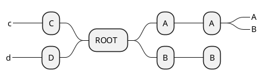

# docsify 寫作模板

[docsify](https://docsify.js.org/#/)

## THEME

[docsify-darklight-theme](https://docsify-darklight-theme.boopathikumar.me/#)

## Code

```bash
#!/bin/bash
# 執行快照作業, 並保留最多 114 份 (一天) 的快照紀錄
cv4pve-autosnap --host 192.168 --username root@pam --password <psssword> --vmid 100 snap --label 'hourly' --keep 114
```

## Plant UML

